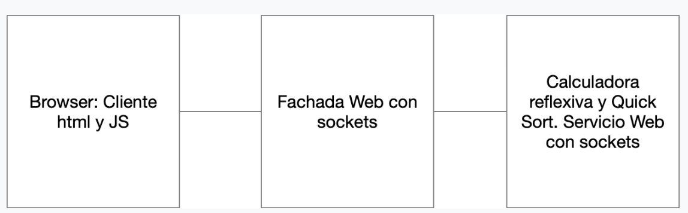

# Bono Parcial corrección  


Este proyecto implementa un servidor web en Java que maneja solicitudes HTTP utilizando sockets. Su función principal es una calculadora que permite realizar operaciones matemáticas mediante la reflexion invocando los métodos de la clase Math y permitiendo organizar una lista mediante el algoritmo de Bubble Sort.
## Arquitectura
Este proyecto sigue la arquitectura cliente-servidor.
La arquitectura maneja solicitudes HTTP, dirigiéndolas al componente adecuado para su procesamiento y devolviendo una respuesta al cliente, cuenta con 3 servicios:

### componentes


- **Fachada de Servicios**: Se encargará de entregar el cliente web y delegar el cálculo al servicio de calculadora.

- **Servicio de Calculadora**: Realiza cálculos matemáticos usando reflexión para invocar métodos de la clase Math y ordena listas usando bubble sort.

- **Cliente Web(HTML + JS)**: Se encarga de recibir solicitudes y enviarlas.




## Empezando

### Requisitos Previos
Para ejecutar este proyecto, necesitarás tener instalado:

- Java JDK 17.
- Un IDE de Java como IntelliJ IDEA, Eclipse, o NetBeans.
- Maven para manejar las dependencias version  4.0.0
- Un navegador web para interactuar con el servidor.

### Instalación

1. Tener instalado Git en tu maquina local
2. Elegir una carpeta en donde guardes tu proyecto
3. abrir la terminal de GIT --> mediante el clik derecho seleccionas Git bash here
4. Clona el repositorio en tu máquina local:
   ```bash
   git clone https://github.com/Medina95/bono-.git
   ```
## Deployment
1. Abre el proyecto con tu IDE favorito o navega hasta el directorio del proyecto
2.  Contruye el proyecto usando maven desde la terminal:

   ```bash
   mvn clean install
   ```
3. Ejecuta las dos clases caculadora y fachada1

   ```bash
    java -cp target/classes org.example.calculadora
   ```
   ```bash
     java -cp target/classes org.example.fachada1   
   ```
4. Verá que el servidor está listo y corriendo sobre el puerto 36000

    - http://localhost:36000/
    - Introduce un comando de tipo bbl(100,4,6,3) o de la clase math en el campo de texto y haz clic en el botón submit para ejecutar la operación 

4. Puedes interactuar con los endpoints RESTful (/api) con:
   - http://localhost:35000/compreFlex?comando=max(1,9)
   - http://localhost:35000/compreFlex?comando=bbl(100,4,6,3)
   - http://localhost:36000/computar?comando=sqrt(9)


## Built With
* [Maven](https://maven.apache.org/) - Dependency Management


## Authors

* **Carolina Medina Acero** -  [Medina95](https://github.com/Medina95)


